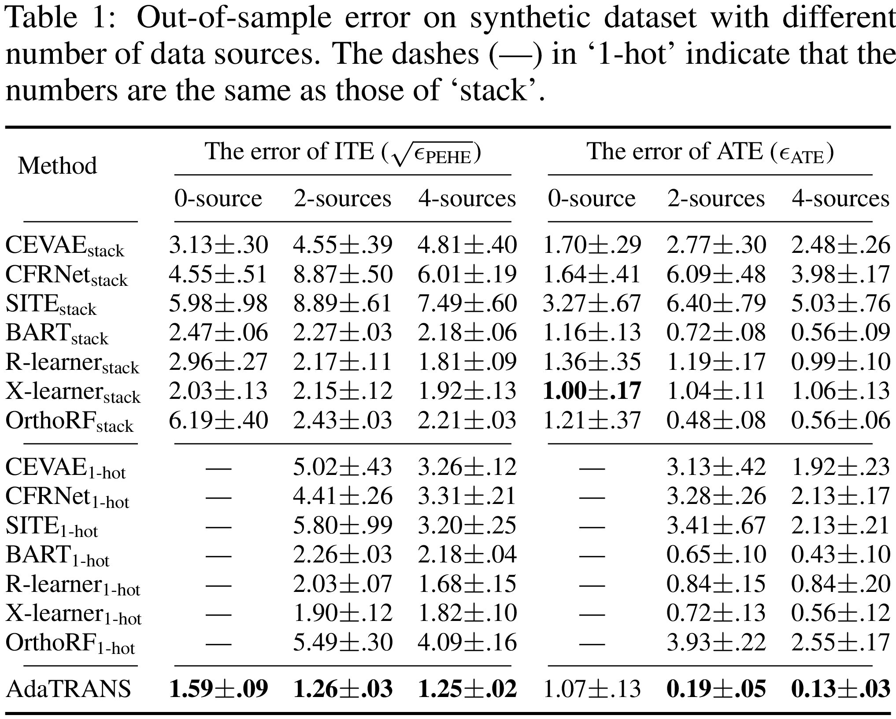

## Adaptive Multi-Source Causal Inference from Observational Data
Vo, T. V., Wei, P., Hoang, T. N., & Leong, T. Y. (2021). Adaptive Multi-Source Causal Inference from Observational Data. arXiv preprint arXiv:2105.14877. https://arxiv.org/pdf/2105.14877.pdf

Please cite:

```
@article{vo2021adaptive,
  title={Adaptive Multi-Source Causal Inference from Observational Data},
  author={Vo, Thanh Vinh and Wei, Pengfei and Hoang, Trong Nghia and Leong, Tze-Yun},
  journal={arXiv preprint arXiv:2105.14877},
  year={2021}
}
```

## Table of contents
  * [Requirements](#requirements)
  * [Import packages and prepare your data](#import-packages-and-prepare-your-data)
    + [Import necessary packages](#import-necessary-packages)
    + [Concatenate sources and target](#concatenate-sources-and-target)
    + [Indicate indices of sources and target data](#indicate-indices-of-sources-and-target-data)
  * [Configuration](#configuration)
  * [Train the model](#train-the-model)
  * [Evaluation](#evaluation)
  * [Some examples](#some-examples)
  * [Some experimental results](#some-experimental-results)


## Requirements
This package has been tested on:
```
gpytorch==1.3.0
pytorch==1.7.0+cu101
```

## Import packages and prepare your data

### Import necessary packages
```python
import torch
from models_train import *
from evaluation import Evaluation
```

### Concatenate sources and target
The training data is a concatenation of all sources and target. 

For example,
* Let ```train_x_source_1```, ```train_y_source_1```, ```train_w_source_1``` be tensors of training data of Source #1
* Let ```train_x_source_2```, ```train_y_source_2```, ```train_w_source_2``` be tensors of training data of Source #2
* Let ```train_x_target```, ```train_y_target```, ```train_w_target``` be tensors of training data of the target domain

Then, we need to concatenate them as follows

```python
train_x = torch.cat((train_x_source_1, train_x_source_2, train_x_target), dim=0)
train_y = torch.cat((train_y_source_1, train_y_source_2, train_y_target), dim=0)
train_w = torch.cat((train_w_source_1, train_w_source_2, train_w_target), dim=0)
```
where ```train_x``` is a matrix of ```n x d_x```, ```train_y``` is a matrix of ```n x 1```, and ```train_w``` is a matrix of ```n x 1```, ```n``` is the total number of data points (sources + target), ```d_x``` is the number of dimension of the proxy variable.

### Indicate indices of sources and target data

This package needs to input a list indices of sources and target in the following format

```python
domain_ranges = [(0,source_1_end), (source_1_end,source_2_end), ..., 
                 (source_m-1_end,source_m_end), (source_m_end,target_end)]
```

**For example:**

Suppose there are ```m = 2``` sources, and they have the same size ```source_size = 1000```. The size of the target training set is ```N_target_train = 50```.

We need to create a list of indices of all the domains (all the sources and the target) as follows:
```python
source_ranges = [(idx, idx+source_size) for idx in range(0,m*source_size,source_size)]
domain_ranges =  source_ranges + [(m*source_size, m*source_size+N_target_train)]
```

Then, 
```python 
domain_ranges = [(0,1000), (1000,2000), (2000,2050)]
```

*** Note that indices of the target data is in the last position of the list ```domain_ranges```, i.e., ```(2000,2050)```.

## Configuration

Configure hyperparameters
```python
OUTPUT_DIR = 'save_outputs/save_multi_source_with_validation_F' # directory to write outputs
dim_z = 45 # dimension of latent confounders z_i
training_iter = 5000 # number of iterations
transfer_flag = FLAGS_LEARN_TRANSFER # FLAGS_LEARN_TRANSFER = adaptively transfer (proposed method),
                                     # FLAGS_FULL_TRANSFER = fully transfer (combine data, set transfer factors to 1),
                                     # FLAGS_NO_TRANSFER = no transfer (set transfer factors to 0),
n_samples = 100
reg_alpha_w, lr_w = 1e-3, 1e-3 # Regularizer and learning rate for learning P(W|X)
reg_alpha_y, reg_noise_y, lr_y =1e-2, 1e-1, 1e-3 # Regularizer and learning rate for learning P(Y|X,W)
reg_alpha_zy, lr_zy =1e-1, 1e-2 # Regularizer and learning rate for learning P(Z|Y,X,W) and P(Y|W,Z)
```

## Train the model

Train the three models to learn P(W|X), P(Y|X,W), P(Z|Y,X,W), and P(Y|W,Z)
```python
# Learning P(W|X)
model_w = trainW(train_x=train_x,
                 train_w=train_w.reshape(-1),
                 n_domains=m+1, domain_ranges=domain_ranges,
                 training_iter=training_iter, transfer_flag=transfer_flag,
                 reg_alpha=reg_alpha_w, lr=lr_w)

# Learning P(Y|X,W)
model_y = trainY(train_x=train_x,
                 train_y=train_y,
                 train_w=train_w,
                 n_domains=m+1, domain_ranges=domain_ranges,
                 training_iter=training_iter, transfer_flag=transfer_flag,
                 reg_alpha=reg_alpha_y, reg_noise=reg_noise_y, lr=lr_y)

# Learning P(Z|Y,X,W) and P(Y|W,Z)
model_zy = trainZY(train_x=train_x,
                   train_y=train_y,
                   train_w=train_w,
                   n_domains=m+1, domain_ranges=domain_ranges, dim_z=dim_z,
                   training_iter=training_iter, transfer_flag=transfer_flag,
                   reg_alpha=reg_alpha_zy, lr=lr_zy)
```
## Evaluation
Let ```xtte```, ```ytte```, ```wtte``` be tensors of the testing data.

Since we only test on target data, so the list of indices of all domains is as follows:
```python
domain_ranges = [(0,0)]*m+[(0,xtte.shape[0])]
```
where ```m``` is the number of sources.

**Evaluate P(W|X)**
```python
accur = torch.sum((model_w.pred(xtte, domain_ranges=domain_ranges)>0)*1.0==wtte.reshape(-1))/len(xtte)
```
**Evaluate P(Y|X,W)**
```python
mae = torch.mean(torch.abs(model_y.pred(xtte, wtte, domain_ranges=domain_ranges).reshape(-1) - ytte.reshape(-1)))
rmse = torch.sqrt(torch.mean((model_y.pred(xtte, wtte, domain_ranges=domain_ranges).reshape(-1) - ytte.reshape(-1))**2))
```

**Evaluate ATE, ITE**
```python
w_samples = model_w.sample(x=xtte,n_samples=n_samples) # Draw w samples from P(W|X)
y_samples_xw = model_y.sample(x=xtte,w_samples=w_samples,n_samples=n_samples) # Draw y samples from P(Y|X,W)

y_samples_do0,_ = model_zy.sample_v2(xtte, do_w=torch.zeros((xtte.shape[0],1),device=device),
                                      y_samples=y_samples_xw, w_samples=w_samples, n_samples=n_samples)
y_samples_do1,_ = model_zy.sample_v2(xtte, do_w=torch.ones((xtte.shape[0],1),device=device),
                                      y_samples=y_samples_xw, w_samples=w_samples, n_samples=n_samples)

y_do0_mean = torch.mean(y_samples_do0, dim=1)
y_do1_mean = torch.mean(y_samples_do1, dim=1)

eval = Evaluation(m0=mu0_target_te, m1=mu1_target_test)
abs_err = eval.absolute_err_ate(y_do0_mean.cpu().detach().numpy(), y_do1_mean.cpu().detach().numpy())
pehe = eval.pehe(y_do0_mean.cpu().detach().numpy(), y_do1_mean.cpu().detach().numpy())
```
## Some examples

We recommend to start with these examples:
* [example_synthetic_one_source.ipynb](example_synthetic_one_source.ipynb)
* [example_synthetic_multi_source.ipynb](example_synthetic_multi_source.ipynb)


## Some experimental results

**Synthetic dataset: transfer analysis**


***

**Synthetic dataset: multi-source analysis**


<br/>


***

**TWINS dataset**


